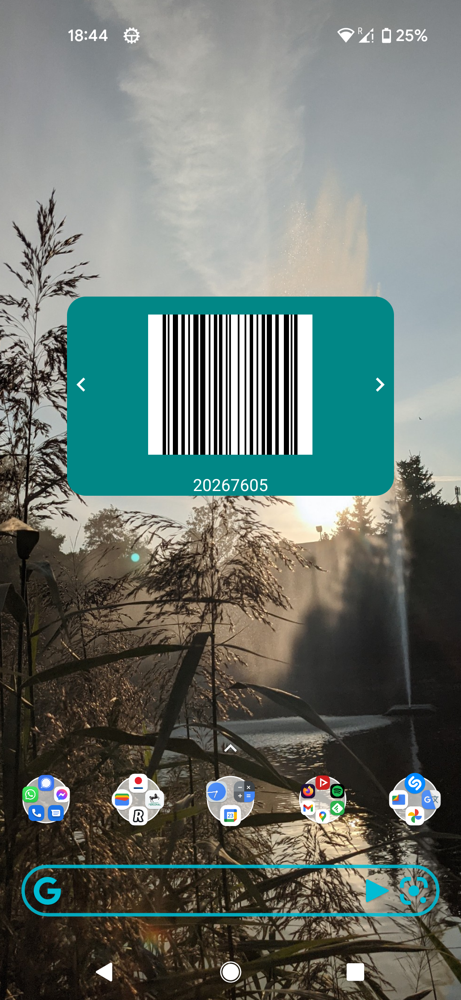

## A native Android mobile app for barcode generating

The app allows to generate or scan the barcodes, saving and browsing them on the device, as well as displaying them as an home screen widget.

[ZXing library](https://github.com/zxing/zxing) used for barcode image processing.

|||
|--|--|

|||
|--|--|

|||
|--|--|
